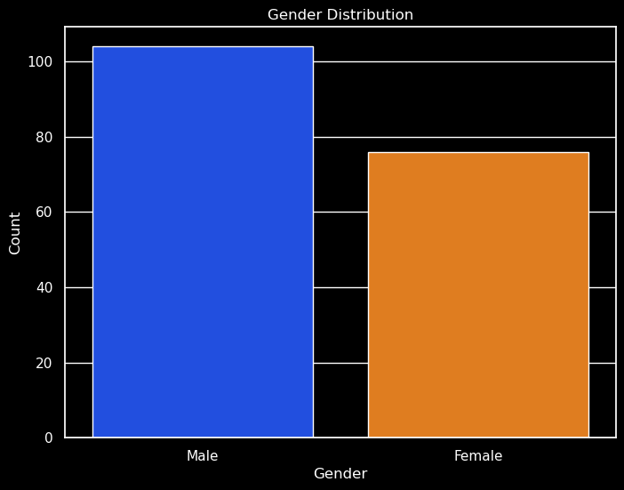
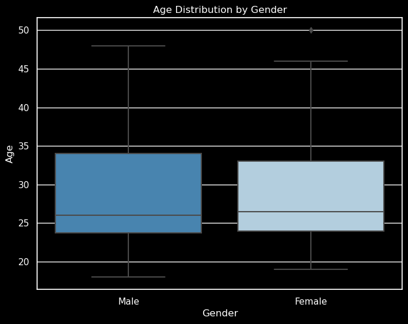
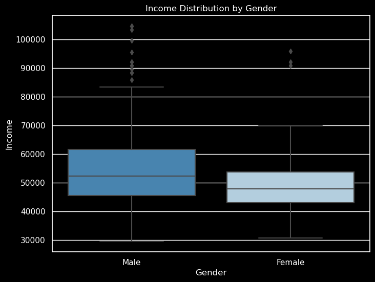
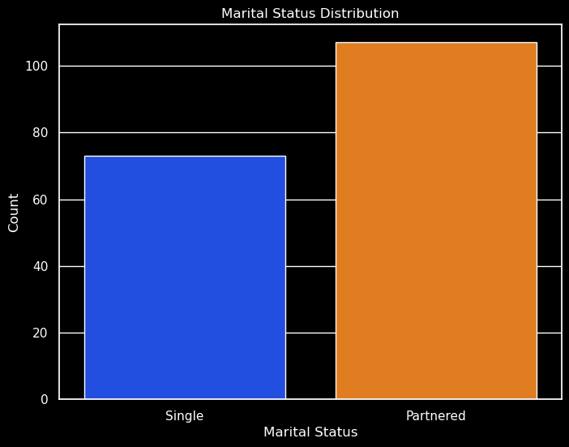
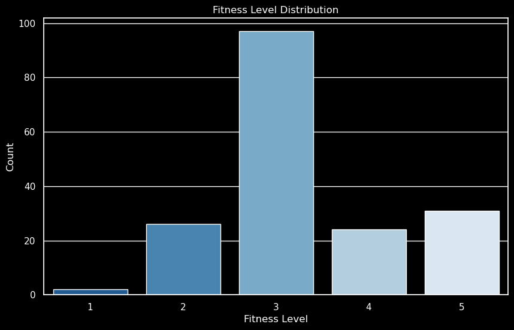
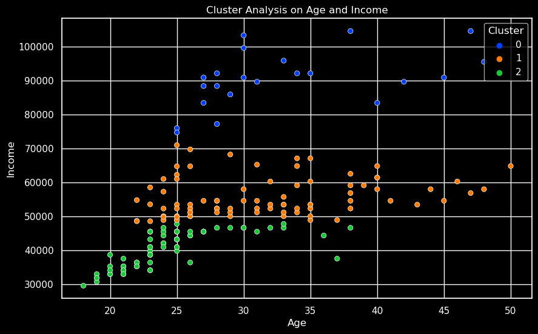

# Treadmill_Business_Analysis
A repo showcasing a business analysis performed for treadmill sales data.

## Project Overview
This project involves:
- An exploratory data analysis (EDA)
- A Product analysis 

The primary goal is to uncover insights that can inform business strategies and customer understanding.

## Methodology
The EDA was conducted using Python, with libraries such as Pandas, Seaborn, and Matplotlib. Key steps included:

- Descriptive statistics for numeric and non-numeric data.
- Visualizations to understand distributions and relationships.
- Correlation analysis to identify potential links between variables.
- Cluster analysis to discover patterns and groupings in the data.

## Key Findings

The dataset showed a slightly higher number of **male** participants compared to **females**.

Boxplots revealed distinct distributions for **age and income** when segmented by gender.

The **majority** of participants were **partnered**.

Different **treadmill products** showed varying popularity across different **income** groups.

The **fitness levels** of participants varied, with a concentration in the **mid-range**.

The **cluster analysis** revealed distinct groupings within the data, suggesting different customer segments.

## Conclusion
The EDA provided valuable insights into the treadmill sales data, highlighting key trends and patterns. These findings can assist in tailoring marketing strategies, product development, and customer engagement efforts.
