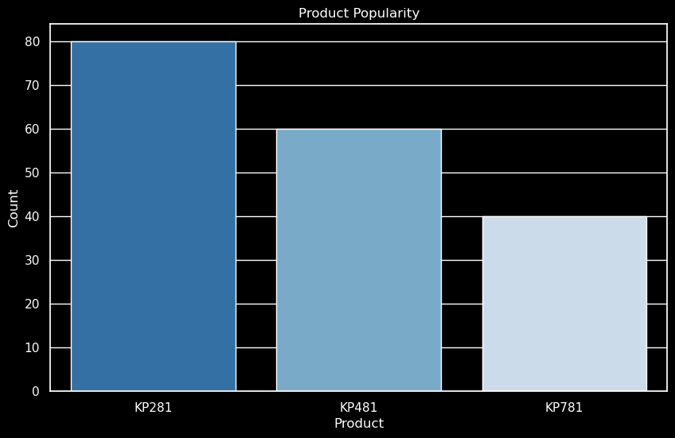
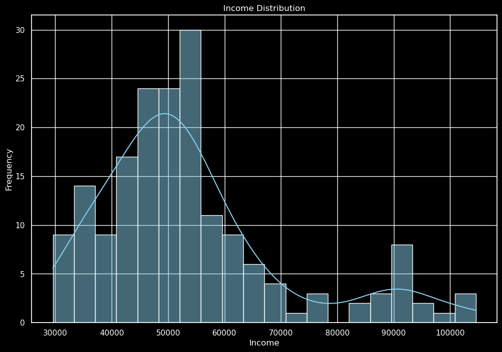
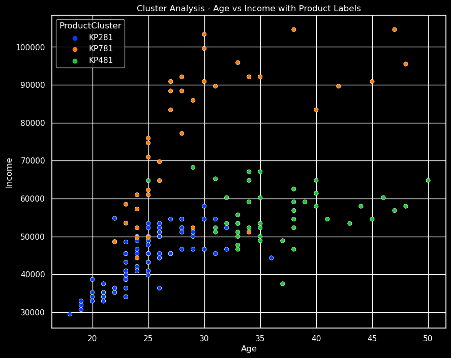
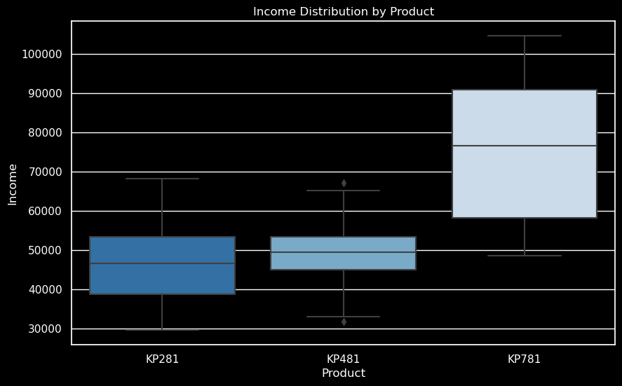

# 🏃 Treadmill_Business_Analysis
A repo showcasing a business analysis performed for treadmill sales data.

## 🔎 Project Goal

The goal is to give data-driven insights and recommendations to increase the sales of the KP781 model.

## 📝 Methodology

- **Data Exploration & EDA:** Initial exploration of the dataset to understand the distribution and characteristics of various features.
- **In-Depth Product Analysis:** Focused analysis on the Products, comparing different treadmill models.

## 👀 Exploratory Data Analysis

### Product Distribution Overview 📊

- **KP281:** Highest distribution count, indicating a strong market presence.
- KP481: Moderate distribution, trailing behind KP281.
- KP781: Lowest distribution, suggesting a niche or emerging product status.

**KP281 dominates the market** with the highest count, significantly surpassing KP481 and KP781.

### Age Distribution Analysis 📉

- **Peak Frequency:** Occurs in the 25-30 age range, indicating a concentration of younger individuals.
- **Notable Decrease:** Post-30 age frequency declines significantly, highlighting a youthful demographic profile.
- **Limited Senior Representation:** Sparse data points beyond 40 years, suggesting limited engagement from older age groups.

**The age distribution is skewed towards a younger demographic**, peaking between 25-30 years.

### Income Distribution Summary 📉💰

- **Middle-Class Predominance:** A concentration around the $50,000 income level suggests a middle-class demographic.
- **Higher Income Rarity:** Fewer occurrences above $70,000, highlighting the rarity of higher income levels in the dataset.
- **Outliers:** Presence of outliers at both ends may indicate exceptional cases or data entry errors.

**Most frequent income bracket is around $50,000**, with a notable decrease in frequency as income increases.

### Cluster Analysis: Age vs Income with Product Labels 🎯📊

- **KP281 (Blue):** Concentrated in the lower income bracket, mainly among individuals under 30.
- **KP781 (Orange):** Dispersed across a wide range of incomes, slightly favoring the 30-40 age group.
- **KP481 (Green):** Scattered distribution, with a presence in both lower and higher income categories, not showing a strong age preference.

**KP281 is popular among younger demographics with lower incomes**, while **KP781 and KP481** are more scattered across various age and income groups.

## Product Analysis

### Income Distribution by Product Analysis 📈

- **KP281 & KP481:** Similar income ranges, suggesting comparable market performance.
- **KP781:** Not only the highest median income but also a wider income range, implying greater variability and possibly higher market value per unit.

**KP781 shows the highest income potential**, with its box plot indicating a significantly higher median income compared to KP281 and KP481.

## Conclusion
The EDA provided valuable insights into the treadmill sales data, highlighting key trends and patterns. These findings can assist in tailoring marketing strategies, product development, and customer engagement efforts.
