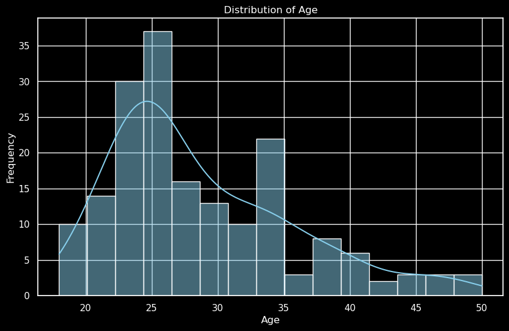

# 🏃 Treadmill Sales Analysis

## ℹ️ Disclaimer

The original iteration of this project was completed independently several months ago and is titled 'Treadmill Sales'. The current version, which incorporates AI assistance, comprises '0_Exploratory_Data_Analysis' and '1_Product_Analysis'. This structure was adopted to delineate the enhanced scope and to facilitate an in-depth understanding of AI applications in analytics. AI's role spanned from generating visualization code to producing and formatting this markdown documentation. The intent behind this approach was to gauge the practicality and limitations of AI within data analytics workflows.

## 🔎 Project Goal

The goal is to give data-driven insights and recommendations to increase the sales of the KP781 model.

## Treadmill Product Portfolio & Data Description 🏃‍♂️💼

### Product Portfolio:
- **KP281**: Entry-level treadmill, priced at $1,500, catering to beginners.
- **KP481**: Designed for mid-level runners, with a price point of $1,750.
- **KP781**: Advanced treadmill for the most dedicated runners, available for $2,500.

### Dataset Features:
- **Product**: Type of treadmill purchased - KP281, KP481, or KP781.
- **Age**: Age of the customer in years.
- **Gender**: Male or Female.
- **Education**: Number of years of education completed.
- **Marital Status**: Single or Partnered.
- **Usage**: Expected weekly usage frequency.
- **Fitness**: Self-rated fitness level on a scale from 1 (poor shape) to 5 (excellent shape).
- **Income**: Annual income in USD.
- **Miles**: Estimated average weekly mileage on the treadmill.

### 📝 Methodology
- **Data Exploration & EDA:** Initial exploration of the dataset to understand the distribution and characteristics of various features.
- **In-Depth Product Analysis:** Focused analysis on the Products, comparing different treadmill models.

## 👀 Exploratory Data Analysis

### Product Distribution Overview 📊

- **KP281:** Highest distribution count, indicating a strong market presence.
- KP481: Moderate distribution, trailing behind KP281.
- KP781: Lowest distribution, suggesting a niche or emerging product status.

**KP281 dominates the market** with the highest count, significantly surpassing KP481 and KP781.

### Age Distribution Analysis 📉

- **Peak Frequency:** Occurs in the 25-30 age range, indicating a concentration of younger individuals.
- **Notable Decrease:** Post-30 age frequency declines significantly, highlighting a youthful demographic profile.
- **Limited Senior Representation:** Sparse data points beyond 40 years, suggesting limited engagement from older age groups.

**The age distribution is skewed towards a younger demographic**, peaking between 25-30 years.

### Income Distribution Summary 📉💰

- **Middle-Class Predominance:** A concentration around the $50,000 income level suggests a middle-class demographic.
- **Higher Income Rarity:** Fewer occurrences above $70,000, highlighting the rarity of higher income levels in the dataset.
- **Outliers:** Presence of outliers at both ends may indicate exceptional cases or data entry errors.

**Most frequent income bracket is around $50,000**, with a notable decrease in frequency as income increases.

### Cluster Analysis: Age vs Income with Product Labels 🎯📊

- **KP281 (Blue):** Concentrated in the lower income bracket, mainly among individuals under 30.
- **KP781 (Orange):** Dispersed across a wide range of incomes, slightly favoring the 30-40 age group.
- **KP481 (Green):** Scattered distribution, with a presence in both lower and higher income categories, not showing a strong age preference.

**KP281 is popular among younger demographics with lower incomes**, while **KP781 and KP481** are more scattered across various age and income groups.

## Product Analysis

### Income Distribution by Product Analysis 📈

- **KP281 & KP481:** Similar income ranges, suggesting comparable market performance.
- **KP781:** Not only the highest median income but also a wider income range, implying greater variability and possibly higher market value per unit.

**KP781 shows the highest income potential**, with its box plot indicating a significantly higher median income compared to KP281 and KP481.

### Treadmill Usage by Product: Weekly Mileage 🏃‍♂️📊

- **KP281 (Blue):** Consistent lower mileage suggests it may cater to casual users or beginners.
- **KP481 (Light Blue):** Slightly higher mileage than KP281, could be preferred by regular exercisers.
- **KP781 (Dark Blue):** Highest mileage with greater variation, likely favored by serious runners or those training for events.

**KP781 users expect to cover more miles weekly**, indicating its appeal to more active users or those with higher fitness goals.

### Gender-Based Product Preference Analysis 📊👫

- **KP281:** Equally preferred by both genders, indicating a universal appeal.
- **KP481:** Slight male preference, but still comparably popular among females.
- **KP781:** Markedly less favored by females, suggesting it may be better suited or marketed towards male users.

**Both males and females show similar preferences for KP281 and KP481**, while **KP781 has a notably lower female preference**.

### Product Preference by Fitness Level🏋️‍♂️📊

- **KP281 & KP481:** Both products have similar fitness level preferences, indicating their suitability for average fitness users.
- **KP781:** Significantly higher preference from the more fitness-focused users, suggesting it's tailored for advanced training needs.

**KP781 is the favored choice among users with higher fitness levels**, whereas KP281 and KP481 are preferred by those with moderate fitness levels.

## Final Results: Enhancing KP781 Sales Strategy 🚀📈

### Key Insights for Boosting KP781 Treadmill Sales:

To increase the sales of the premium KP781 treadmill model, we must leverage the data-driven insights gained from our analysis:

- **Target Fitness Enthusiasts**: Given that KP781 is preferred by users with higher fitness levels, marketing campaigns should be directed towards fitness enthusiasts and individuals who are more serious about running and training.
- **Focus on Higher Income Segments**: The data indicates a correlation between higher income and the preference for KP781. Tailoring promotions to higher-income demographics could yield better sales conversions.
- **Gender-Inclusive Marketing**: Although our data shows a male preference for KP781, inclusive marketing can tap into the female market by highlighting features that appeal across genders, such as safety, versatility, and technology integration.

Implementing these strategies should lead to an uptick in the sales of the KP781 treadmill as we align our product strengths with customer preferences and market trends.